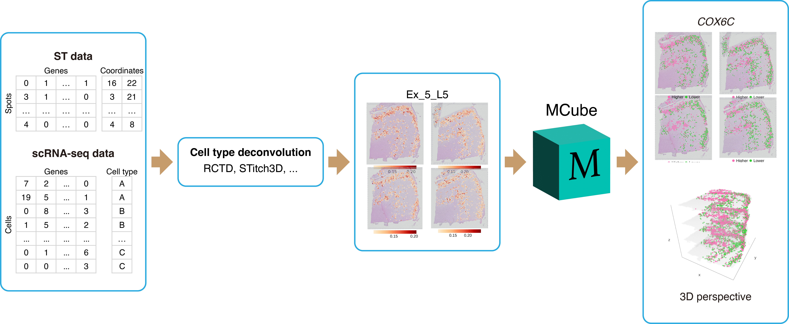

<!-- README.md is generated from README.Rmd. Please edit that file -->

```{r, include = FALSE}
knitr::opts_chunk$set(
  collapse = TRUE,
  comment = "#>",
  fig.path = "man/figures/README-",
  out.width = "100%"
)
```

# MCube: Identifying cell-type-specific spatially variable genes with the Mixture of Mixed Models <a href="https://mcube-tutorial.readthedocs.io/"></a>

<!-- badges: start -->


[](https://hits.seeyoufarm.com)


<!-- [](https://github.com/YangLabHKUST/MCube/actions/workflows/R-CMD-check.yaml) -->

<!-- badges: end -->

## Introduction

The R package `MCube` implements the methods in the **MMM** paper.
**MMM**, standing for the **Mixture of Mixed Models**, is a unified framework for statistical identification of cell-type-specific spatially variable genes in spatial transcriptomic (ST) studies.
<!-- Beginning with the raw count data, **MMM** uses a log-mixture structure to account for cell type composition while simultaneously correcting for the spot and platform effects between ST and scRNA-seq data. -->
<!-- Then,	the mixed-effects model decomposes the cell-type-specific gene expression in ST data into three components: the average gene expression of the same cell type obtained from scRNA-seq data, spatial variations, and non-spatial variations, enabling a statistically rigorous way to examine the significance of the spatial variations. -->
<!-- The statistical significance of spatial variations is examined using a powerful non-parametric test capable of detecting diverse spatial patterns. -->

<figure>

</figure>

## Installation

You can install the development version of `MCube` from [GitHub](https://github.com/) with:

``` r
# install.packages("devtools")
devtools::install_github("YangLabHKUST/MCube")
```

## Real data analysis

The code for reproducing the real data analysis results presented in our paper are available at the tutorial website (<https://mcube-tutorial.readthedocs.io/>):

* [Visium human dorsolateral prefrontal cortex dataset](https://mcube-tutorial.readthedocs.io/en/latest/analysis/DLPFC/)
* [Multiple adult mouse brain datasets from different sources](https://mcube-tutorial.readthedocs.io/en/latest/analysis/mouse_brain/)
* [Xenium human breast cancer dataset](https://mcube-tutorial.readthedocs.io/en/latest/analysis/breast_cancer/)
* [3D *Drosophila* embryo model constructed from Stereo-seq dataset](https://mcube-tutorial.readthedocs.io/en/latest/analysis/Drosophila_embryo/)

## Reference

If you find the `MCube` package or any of the source code in this repository useful for your work, please cite:

> A unified framework for identification of cell-type-specific spatially variable genes in spatial transcriptomic studies.  
Zhiwei Wang, Yeqin Zeng, Ziyue Tan, Yuheng Chen, Xinrui Huang, Hongyu Zhao, Zhixiang Lin, and Can Yang.  
2025.

## Development

The R package `MCube` is developed by [Zhiwei Wang](https://sites.google.com/view/statwangz).

## Contact

Please feel free to contact [Zhiwei Wang](mailto:zhiwei.wang@connect.ust.hk) or [Prof. Can Yang](mailto:macyang@ust.hk) if any inquiries.
